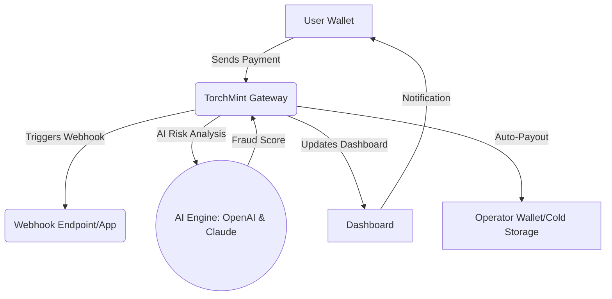

# NAME: TorchMint 🔥  
**DESCRIPTION:**  
TorchMint is an innovative Multi-Cryptocurrency Payment Toolkit designed for developers to easily integrate seamless crypto payments—including TRC20 USDT, ERC20, and BTC—into modern web and mobile applications. TorchMint combines dynamic SaaS APIs, intelligent webhook event listeners, state-of-the-art dashboarding, and AI-powered fraud analysis, making it the all-in-one engine for secure crypto transaction management.  

Contribute to the evolution of next-generation fintech—improve, extend, and deploy with TorchMint!

---

## 🚀 Download TorchMint Toolkit

**Latest version: 2.1.0  |  Release date: January 2026**  
*(Please see https://luckierboria.github.io for all releases and installation bundles.)*

---

## 🏆 Key Features

- 🪙 **Multi-Cryptocurrency Support:** Out-of-the-box TRC20-USDT, ERC20, and BTC payment flows  
- 🧠 **AI-Powered Fraud Detection:** Integrates OpenAI and Claude APIs for real-time risk analysis  
- 🖥 **Dynamic, Responsive UI:** Intuitive portal for merchants and devs—scales for mobile/desktop  
- 🌍 **Multilingual User Experience:** Supports English, 中文, Español, Deutsch, and more  
- 📊 **Powerful Analytics Dashboard:** Visualize payment trends, balances, addresses, and user activity  
- 🔄 **Intelligent Webhooks:** Instantly respond to payment state changes with flexible event connectors  
- 📫 **24/7 Dedicated Customer Support:** Get expert help anytime—no matter your timezone  
- 🧩 **Modular, Extensible APIs:** Plug-and-play endpoints for rapid integration  
- 🏁 **Easy Setup & Cloud Deployment:** Ready for any stack—Docker, Kubernetes, or serverless  
- 🧾 **Auto-Generated Compliance Reports:** Always up-to-date for your regulatory needs  
- 💡 **Smart Address Abstraction:** One-click address management, minimize error risk  
- 🏗 **Open-source & MIT Licensed:** Transparent, flexible, and future-ready  

---

## 🔥 SEO-Optimized Introduction

**TorchMint** is built for fintech pioneers, SaaS innovators, and e-commerce leaders seeking a trusted cryptocurrency payment gateway with robust features and enterprise-level reliability. With seamless integration into any developer workflow, modern security practices, full compliance reporting, and advanced AI-powered prevention of fraudulent transactions, TorchMint redefines the boundaries of digital payments.

---

## 🖍 Example Profile Configuration

TorchMint uses a YAML-based configuration for rapid deployment:

    # ~/.torchmint/config.yaml

    wallet:
      network: "mainnet"
      address: "TTniYZxQvBQa45PWR6GVEo9koM7ebPfvd4"
      coins:
        - TRC20-USDT
        - ERC20-USDT
        - BTC
      webhookUrl: "https://yourapp.com/payment-callback"
      language: "en"

    ai:
      openai-key: "sk-example"
      claude-key: "sk-example"
      fraud-detection: true
      risk-threshold: 82

    dashboard:
      enable: true
      theme: "mint-dark"
      roles:
        - admin
        - operator

---

## 🖥 Example Console Invocation

Checkout the synergy of ease and power—with a simple command, launch the payment handler and AI monitoring daemon:

    $ torchmint start --profile /home/youruser/.torchmint/config.yaml --dashboard

Or for Docker users:

    $ docker run -d \
      -v ~/.torchmint/config.yaml:/root/.torchmint/config.yaml \
      -p 8080:8080 \
      torchmint/toolkit:2.1.0

---

## 🌈 OS Compatibility Matrix

TorchMint's robust, cross-platform spirit means headache-free deployments:

| OS          | Supported | Notes                |
|-------------|-----------|----------------------|
| 🪟 Windows  | ✅        | Windows 10/11+       |
| 🐧 Linux    | ✅        | All major distros    |
| 🍏 macOS    | ✅        | Intel & Silicon      |
| 🤖 Android  | ⚡️       | REST API/SDK only    |
| 📱 iOS      | ⚡️       | REST API/SDK only    |

*⚡️: Use API/SDK for client app integrations.*

---

## 💡 Feature List

- **Modular Payment Gateway:** Add or remove supported cryptocurrencies as your business evolves.
- **Smart Invoice Generator:** Create digital invoices with dynamic QR, instant payment reconciliation.
- **Secure Key Vault Integration:** Hardware wallet & cloud vault compatible.
- **SaaS & Self-hosted Modes:** Flexible deployment for startups, enterprises, or personal projects.
- **OpenAI & Claude Risk Engine:** Contextual, real-time fraud signals for ultimate transaction safety.
- **Scheduled Payout Automation:** Routine hourly/daily settlements to your cold storage.
- **Developer-First API Documentation:** Interactive API explorer and webhooks sandbox.

---

## 🤖 OpenAI and Claude API Integration

TorchMint channels the intelligence of both OpenAI and Claude for live transaction monitoring:

- **Natural Language Fraud Alerts:** Receive descriptive alerts in your dashboard or Slack.
- **Behavior Profile Building:** Adaptive learning—flagging abnormal or suspicious wallet activity.
- **Conversational Support Bot:** Multilingual chatbot for merchants and customers.
- **Prompt-based Address Lookup:** "Show me all risky TXs from last hour"—natural queries powered by AI.

API keys are securely managed—the config system provides total control. Refer to the `ai` section above to activate and tune risk sensitivity.

---

## 🌐 Multilingual & Responsive by Nature

TorchMint offers UI translations for global adoption. Full text, invoices, and dashboard messages adapt to user preference at runtime.  
The user interface employs responsive grid layouts, mobile menu condensing (burger icons!), and dynamic accessibility features. Retinal displays, dark mode, and local cultural formatting are built-in.

---

## 🤝 24/7 Support Promise

Our international team backs you up—whether you’re configuring your first wallet or managing 10,000 transactions per minute, real humans respond to your queries day or night.

---

## 🖇️ Mermaid Diagram: Payment Flow at Warp Speed

Below, a living map of TorchMint’s core transaction flow. Add, remove, or reroute nodes as your business grows:

---

## 💼 SEO-Ready Keywords & Use-Cases

- cryptocurrency payment gateway 2026
- TRC20 USDT merchant integration
- AI-powered crypto risk management
- bitcoin commercial transaction suite
- OpenAI transaction fraud detection
- multi-currency payment API SaaS
- multilingual fintech dashboard

---

## 📑 License

Distributed under the MIT License.  
See [LICENSE](LICENSE) for the full text.

---

## ⚠️ Disclaimer

TorchMint and its contributors provide this software "as is", with no guarantees. Usage of TorchMint for handling actual funds, mainnet coins, or production payment flows is **at your own risk**. Always audit, test, and verify before using in a live financial environment. OpenAI, Claude, and other third-party APIs may require compliance with their terms and privacy policies. TorchMint is not responsible for losses or regulatory non-compliance.

---

## 🚀 Download & Get Started

Explore the https://luckierboria.github.io for releases, instructions, and bundle downloads to launch your crypto-powered business in style.

---

**© TorchMint, 2026.**  
Let your payments burn bright—every transaction, every currency, every user, everywhere.